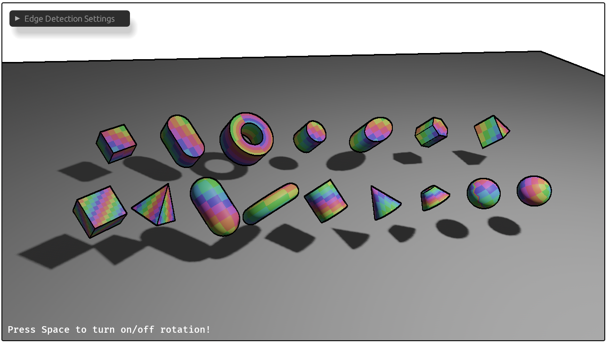

# Bevy Edge Detection Outline

## Overview

A post-processing outline effect for Bevy that detects edges from depth, normals, and/or color and draws customizable outlines. This is a re-implementation of the original plugin updated for modern Bevy rendering pipelines.



## Version compatibility

| Crate version | Bevy version |
| --- | --- |
| 0.2.x | 0.18.x |
| 0.1.x | 0.17.x |

## Features

- **Plugin-based**: Add `EdgeDetectionPlugin` to your app; no manual render graph wiring.
- **Edge sources**: Toggle depth-, normal-, and color-based edge detection independently.
- **Quality controls**: Per-source thresholds and thickness values.
- **Stylization**: UV distortion controls and configurable `edge_color`.
- **Camera prepasses**: Uses `DepthPrepass` and `NormalPrepass`.
- **MSAA/HDR aware**: Specializes pipelines for MSAA and HDR view targets.
- **Works with SMAA**: You can order outlines before SMAA if desired.

## Usage

Add the plugin and enable the prepasses on your camera; attach `EdgeDetection` to the camera entity to configure the effect.

```rust
use bevy::prelude::*;
use bevy_edge_detection_outline::{EdgeDetectionPlugin, EdgeDetection};

fn main() {
    App::new()
        .add_plugins(DefaultPlugins)
        .add_plugins(EdgeDetectionPlugin::default())
        .add_systems(Startup, setup)
        .run();
}

fn setup(mut commands: Commands) {
    commands.spawn((
        Camera3d::default(),
        bevy::core_pipeline::prepass::DepthPrepass::default(),
        bevy::core_pipeline::prepass::NormalPrepass::default(),
        EdgeDetection::default(),
    ));
}
```

## Run the example

- **Linux/macOS/Windows**:
  - `cargo run --example 3d_shapes`

- **WSL2 (Windows Subsystem for Linux)**:
  - `WINIT_UNIX_BACKEND=x11 cargo run --example 3d_shapes`

### Example controls

- **Space**: toggle auto-rotation.
- **Mouse**: orbit/pan/zoom via `PanOrbitCamera`.
- **In-UI**: adjust thresholds, thicknesses, UV distortion, and `edge_color` via the EGUI window.

## Run on WebAssembly (wasm32, WebGPU)

This repo serves the example via Vite. Use pnpm for the dev server, and `build.sh` to produce the wasm/JS artifacts.

### Prerequisites

```bash
rustup target add wasm32-unknown-unknown
cargo install -f wasm-bindgen-cli
npm install -g pnpm
pnpm install
```

### Build WebAssembly bundle

```bash
./build.sh
```

This compiles `examples/3d_shapes.rs` to `wasm32-unknown-unknown` and runs `wasm-bindgen`, outputting JS/WASM into `target/` consumed by `index.html`.

### Start the dev server

```bash
pnpm dev
```

Open the shown localhost URL and press Enter or click “Start Game”. Re-run `./build.sh` to rebuild, then refresh the page.

Notes:
- Requires a browser with WebGPU enabled.

## Acknowledgments

This project is a re-implementation of the [bevy_edge_detection](https://github.com/AllenPocketGamer/bevy_edge_detection) plugin, updated for modern Bevy.