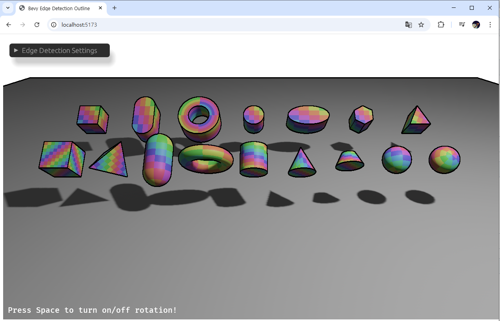

# Bevy Edge Detection Outline

## Overview

A post-processing outline effect for Bevy that detects edges from depth, normals, and/or color and draws customizable outlines. Supports two edge detection operators — **Sobel** (3x3, wider strokes) and **Roberts Cross** (2x2, clean 1px edges) — switchable at runtime.



## Version compatibility

| Crate version | Bevy version |
| --- | --- |
| 0.3.x | 0.18.x |
| 0.2.x | 0.18.x |
| 0.1.x | 0.17.x |

## Features

- **Plugin-based**: Add `EdgeDetectionPlugin` to your app; no manual render graph wiring.
- **Two operators**: `EdgeOperator::Sobel` (3x3 kernel, 8 samples) and `EdgeOperator::RobertsCross` (2x2 kernel, 4 samples, default). Switch at runtime via `EdgeDetection.operator`.
- **Edge sources**: Toggle depth-, normal-, and color-based edge detection independently.
- **Quality controls**: Per-source thresholds and thickness values.
- **Steep angle compensation**: Adjustable threshold and multiplier to suppress false edges on grazing surfaces.
- **Flat surface rejection**: Suppress edges on flat surfaces (e.g. terrain tiles) based on normal Y threshold.
- **Edge masking**: Prepass alpha channel controls which geometry receives outlines (`alpha=1.0` = outlines, `alpha=0.0` = suppressed).
- **Stylization**: UV distortion (via noise texture), pixelation (`block_pixel`), and configurable `edge_color`.
- **Camera prepasses**: Uses `DepthPrepass` and `NormalPrepass`.
- **MSAA/HDR aware**: Specializes pipelines for MSAA and HDR view targets.

## Edge Operators

| Operator | Kernel | Samples | Edge Width | Best For |
| --- | --- | --- | --- | --- |
| **Sobel** | 3x3 | 8 per type | ~2px | Thicker, stylized outlines |
| **Roberts Cross** | 2x2 | 4 per type | 1px | Crisp pixel art, low-res rendering |

```rust
use bevy_edge_detection_outline::{EdgeDetection, EdgeOperator};

// Roberts Cross (default) — clean 1px outlines
EdgeDetection::default()

// Sobel — wider, stronger outlines
EdgeDetection {
    operator: EdgeOperator::Sobel,
    ..default()
}
```

## Usage

Add the plugin and attach `EdgeDetection` to the camera entity.

```rust
use bevy::prelude::*;
use bevy_edge_detection_outline::{EdgeDetectionPlugin, EdgeDetection};

fn main() {
    App::new()
        .add_plugins(DefaultPlugins)
        .add_plugins(EdgeDetectionPlugin::default())
        .add_systems(Startup, setup)
        .run();
}

fn setup(mut commands: Commands) {
    commands.spawn((
        Camera3d::default(),
        EdgeDetection::default(),
    ));
}
```

## Parameters

| Parameter | Default | Description |
| --- | --- | --- |
| `operator` | `RobertsCross` | Edge detection operator (Sobel or RobertsCross) |
| `depth_threshold` | `0.9` | Depth gradient threshold for edge detection |
| `normal_threshold` | `0.45` | Normal gradient threshold for edge detection |
| `color_threshold` | `0.1` | Color gradient threshold for edge detection |
| `depth_thickness` | `1.0` | Sampling distance for depth edges (in texels) |
| `normal_thickness` | `1.0` | Sampling distance for normal edges (in texels) |
| `color_thickness` | `1.0` | Sampling distance for color edges (in texels) |
| `steep_angle_threshold` | `0.75` | Fresnel angle where steep compensation begins |
| `steep_angle_multiplier` | `0.3` | Depth threshold scale-up at steep angles |
| `edge_color` | `BLACK` | Color of drawn edges |
| `enable_depth` | `true` | Enable depth-based edge detection |
| `enable_normal` | `true` | Enable normal-based edge detection |
| `enable_color` | `false` | Enable color-based edge detection |
| `block_pixel` | `1` | Pixelation block size (1 = no pixelation) |
| `flat_rejection_threshold` | `0.0` | Suppress edges where all normals have Y > threshold (0 = disabled) |

## Run the example

- **Linux/macOS/Windows**:
  - `cargo run --example 3d_shapes`

- **WSL2 (Windows Subsystem for Linux)**:
  - `WINIT_UNIX_BACKEND=x11 cargo run --example 3d_shapes`

### Example controls

- **Space**: toggle auto-rotation.
- **Mouse**: orbit/pan/zoom via `PanOrbitCamera`.
- **In-UI**: adjust thresholds, thicknesses, operator, UV distortion, and `edge_color` via the EGUI window.

## Run on WebAssembly (wasm32, WebGPU)

This repo serves the example via Vite. Use pnpm for the dev server, and `build.sh` to produce the wasm/JS artifacts.

### Prerequisites

```bash
rustup target add wasm32-unknown-unknown
cargo install -f wasm-bindgen-cli
npm install -g pnpm
pnpm install
```

### Build WebAssembly bundle

```bash
./build.sh
```

This compiles `examples/3d_shapes.rs` to `wasm32-unknown-unknown` and runs `wasm-bindgen`, outputting JS/WASM into `target/` consumed by `index.html`.

### Start the dev server

```bash
pnpm dev
```

Open the shown localhost URL and press Enter or click "Start Game". Re-run `./build.sh` to rebuild, then refresh the page.

Notes:
- Requires a browser with WebGPU enabled.

## Changelog

### 0.3.0
- **New: `EdgeOperator` enum** — runtime-switchable Sobel (3x3) and Roberts Cross (2x2) operators.
- **New: Parameters table** — all configurable fields documented.
- **Default changes**: `depth_threshold` 1.0→0.9, `normal_threshold` 0.8→0.45, `steep_angle_threshold` 0.0→0.75, default operator `RobertsCross`.

### 0.2.0
- Updated for Bevy 0.18. Added edge masking, flat surface rejection, steep angle compensation.

### 0.1.0
- Initial release for Bevy 0.17 with Sobel-based depth/normal/color edge detection.

## Acknowledgments

This project is a re-implementation of the [bevy_edge_detection](https://github.com/AllenPocketGamer/bevy_edge_detection) plugin, updated for modern Bevy.

Edge detection techniques reference: [Edge Detection Outlines](https://ameye.dev/notes/edge-detection-outlines/) by Alexander Ameye.
